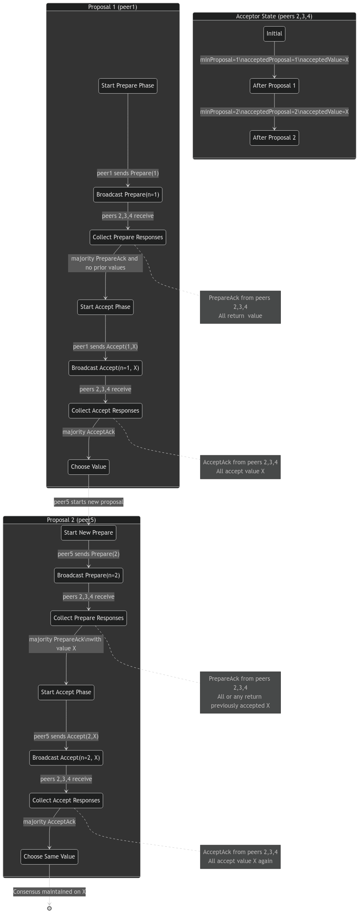

# REPORT: Distributed System Implementation with Paxos

This document provides a detailed overview of the distributed system implemented with the Paxos consensus algorithm. It describes the system architecture and design choices.

## Overview

This system is a distributed implementation of the Paxos consensus algorithm in Go, orchestrated using Docker and Docker Compose to simulate multiple nodes. The primary goal of the system is to achieve consensus across distributed nodes, with each node playing a specific role such as a Proposer, Acceptor, or Learner. Please refer [README](./README.md) to run the program.

## System Architecture

The architecture is modular, with each component encapsulating specific roles and responsibilities within the Paxos protocol. Key components include:

1. **Proposer**: Initiates the consensus process by proposing values.
2. **Acceptor**: Responds to proposals and promises to support a proposal if certain conditions are met.
3. **State Manager**: Manages the state of proposals, including the highest proposal number and accepted values.
4. **TCP Communicator**: Manages inter-node communication.
5. **Configuration Loader**: Reads configuration files to set up nodes and roles.

### Components and Responsibilities

#### 1. Proposer (`proposer.go`)

The **Proposer** is responsible for initiating the Paxos protocol by proposing a value and attempting to gain consensus from Acceptors. It manages two primary phases:
   - **Prepare Phase**: Sends `Prepare` messages to Acceptors with a proposal number.
   - **Accept Phase**: Upon receiving sufficient `Promise` messages, it proceeds to send `Accept` messages with the proposed value.

**Proposer Variables**:
- `proposalNumber`: Tracks the proposal’s unique ID.
- `value`: The value the Proposer seeks to propose.
- `promiseResponses` & `acceptResponses`: Track responses to reach a majority.
- `quorum`: List of Acceptors to communicate with for the consensus process.

**Proposer States**:
1. **Preparing**: Sends a `Prepare` message to all Acceptors to initiate a proposal.
2. **Collecting Promises**: Waits for `Promise` responses from a majority of Acceptors.
3. **Accepting**: Upon reaching a majority of promises, the Proposer proceeds to the `Accept` phase, sending the `Accept` message to finalize the proposal.

#### 2. Acceptor (`acceptor.go`)

The **Acceptor** validates incoming proposals and tracks the highest proposal it has seen. It plays a crucial role in determining whether a proposal can proceed to the `Accept` phase.

**Acceptor Variables**:
- `minProposal`: Tracks the highest proposal number received.
- `acceptedValue`: Stores the value associated with the accepted proposal.

**Acceptor States**:
1. **Waiting for Prepare**: Listens for `Prepare` messages and checks if the proposal number is valid.
2. **Promising**: Responds with a `Promise` message if the proposal is valid and higher than any seen before.
3. **Accepting Proposal**: If conditions are met, the Acceptor responds with an `Accepted` message to indicate agreement.

#### 3. State Manager (`stateManager.go`)

The **State Manager** tracks the state of each node, including the highest seen proposal and the current accepted proposal/value. It provides thread-safe access to the state, crucial for handling concurrent requests.

**State Variables**:
- `minProposal`: The highest proposal number observed.
- `acceptedProposal` and `acceptedValue`: Store the currently accepted proposal and value.

**State Management Operations**:
- `UpdateState`: Updates state variables with new proposals or accepted values.
- `GetMinProposal`: Retrieves the minimum proposal to validate new proposals.

#### 4. TCP Communicator (`tcp.go`)

The **TCP Communicator** handles network communication between nodes, ensuring that messages are reliably sent and received. This module manages connections, formats messages, and retries connections as needed.

**Key Methods**:
- `sendMessage`: Sends messages to specified nodes with retries.
- `Listen`: Listens for incoming messages and dispatches them to appropriate channels.
- `SendPrepareMessage`, `SendAcceptMessage`, and other message-specific functions streamline sending different message types.

#### 5. Configuration Loader (`config.go`)

The **Configuration Loader** initializes the network configuration and role assignment based on an external host file. It parses the file to assign roles (Proposer, Acceptor, Learner) and sets up quorum relationships.

## Flow of Operations

1. **Initialization**:
   - Nodes initialize roles (Proposer or Acceptor) based on the configuration file.
   - Each node establishes TCP connections with peers as defined in the host file.

2. **Prepare Phase**:
   - The Proposer sends a `Prepare` message to all Acceptors.
   - Acceptors respond with a `Promise` if the proposal number is higher than any seen before.

3. **Accept Phase**:
   - Upon receiving a majority of `Promise` messages, the Proposer sends an `Accept` message.
   - Acceptors update their state and respond with `Accepted`.

4. **Completion**:
   - The Proposer reaches consensus if it receives a majority of `Accepted` messages.
   - The final agreed-upon value is confirmed.

## Design Decisions

1. **Concurrency and Synchronization**:
   - The `StateManager` uses mutexes to provide thread-safe access, ensuring consistent updates and retrievals of state in concurrent environments.

2. **TCP Communication**:
   - Reliable messaging between nodes is managed by TCP, with each message serialized and sent to the appropriate node. This ensures that messages reach their intended recipients in the correct order.

3. **Fault Tolerance**:
   - Quorum-based decision-making allows the system to tolerate certain node failures while still reaching consensus.
   - Retries in `TcpCommunicator` enhance reliability by attempting to re-establish connections when a node is unreachable.

4. **Modularity**:
   - By separating the roles into Proposer, Acceptor, and Communicator components, the system maintains modularity, facilitating debugging and future feature expansion.

## State Diagrams

### Proposer State Transition

- **Preparing**: Initiates the proposal with a `Prepare` message.
- **Collecting Promises**: Awaits responses to determine majority.
- **Accepting**: Sends `Accept` message to finalize if a majority of promises is obtained.

### Acceptor State Transition

- **Waiting for Prepare**: Receives and validates incoming `Prepare` messages.
- **Promising**: Responds with a `Promise` if the proposal number is high enough.
- **Accepting**: Confirms agreement to the proposal with an `Accepted` message.

Based on the example, testcase 2, we can visualize the state diagram:

## Conclusion

This distributed system implementation leverages Paxos consensus to achieve reliable, fault-tolerant agreement across nodes. The modular design and synchronized state management ensure robustness, while TCP communication facilitates reliable message exchange. By dividing responsibilities among well-defined components, the system maintains
